# Farah Travels 

View live site here : [Farah Travels](https://farahtravels-e6089254b282.herokuapp.com/)  

For Admin access with relevant sign-in information: [Farah Travels Admin](https://farahtravels-e6089254b282.herokuapp.com/admin/login/?next=/admin/)

#### Farah Travels is a comprehensive travel management app that allows users to seamlessly organise and manage their travel plans. With this app, you can:

- Create and Manage Trips: Easily plan your trips by adding destinations, travel dates, the number of people traveling, departure airport, and other details.
- Receive Notifications: Get timely updates and notifications about your travel plans, helping you stay informed.
- Profile Management: Maintain a detailed user profile, including full name, address, date of birth, phone number, passport number, frequent flyer number, and emergency contact information.
- Search Trips: Effortlessly search for trips based on destination or trip name, making it easy to find and review your travel plans.
- Password Management: Securely reset your password if you forget it, ensuring you always have access to your account.
- User-Friendly Interface: Experience a consistent and professional design across all pages, making navigation and use of the app intuitive and enjoyable.

## Purpose and Target Audience:

### Problem Statement:
Travelers often face challenges in organising their trips, keeping track of important information, and accessing their travel plans on-the-go. Additionally, managing travel-related personal information securely and effectively is essential. Users also need a way to search for and review their travel plans and ensure their profiles are current and accurate.

### Purpose:
Farah Travels is designed to provide a seamless travel management experience. The app will allow users to:

Create and manage trips with detailed information such as destinations, travel dates, number of travelers, and departure airport.
Maintain a comprehensive user profile, including personal and travel-related information such as full name, address, date of birth, phone number, passport number, and emergency contacts.
Search for and review travel plans based on specific criteria.
Securely reset passwords to ensure constant access to their accounts.

### Target Audience:
The primary target audience includes frequent travelers who need a reliable tool to organise their trips. It also targets individuals who value having an up-to-date and secure profile for travel purposes, as well as those who appreciate a user-friendly interface to streamline their travel planning and management processes.

## Persona:

Roxie is a frequent traveller who loves exploring new destinations. She enjoys meticulously planning her trips and values having all her travel information organised in one place. Roxie wants an efficient way to manage her travel plans, keep her personal information up-to-date, and ensure that her trips go smoothly.

## User Stories:

- As a user, I want to be able to create an account so that I can manage my travel plans and profile information.
- As a traveler, I want to be able to create a new trip with detailed information so that I can keep my travel plans organised.
- As a user, I want to view a list of my upcoming trips so that I can easily access and review my travel plans.
- As a traveler, I want to edit the details of my trips so that I can update my plans if anything changes.
- As a user, I want to delete a trip that I no longer plan to take so that my travel list remains current and relevant.
- As a user, I want to create and update my profile with personal and travel-related information so that I can have all my details in one place.
- As a traveler, I want to view my profile information in a structured format so that I can quickly review and ensure my details are accurate.
- As a traveler, I want to search for specific trips based on destination or trip name so that I can quickly find the information I need.
- As a user, I want to receive confirmation messages when I create, update, or delete trips and profiles so that I know my actions were successful.
- As a user, I want to confirm before logging out so that I do not accidentally end my session.
- As a traveller, I want to explore new travel destinations and see detailed information about each location so that I can plan future trips.

## Wireframes:

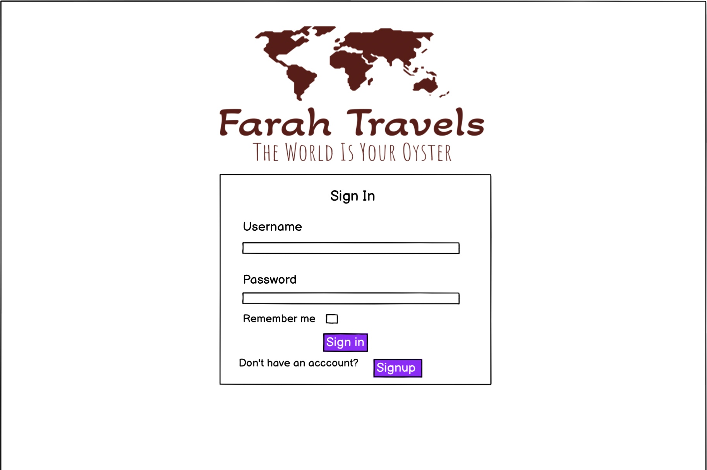
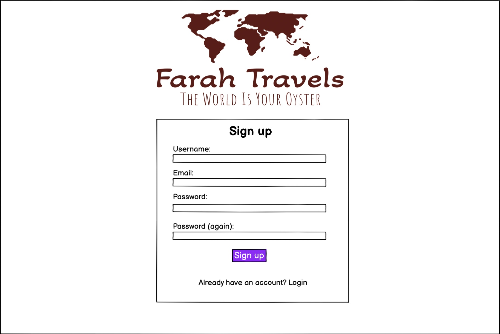
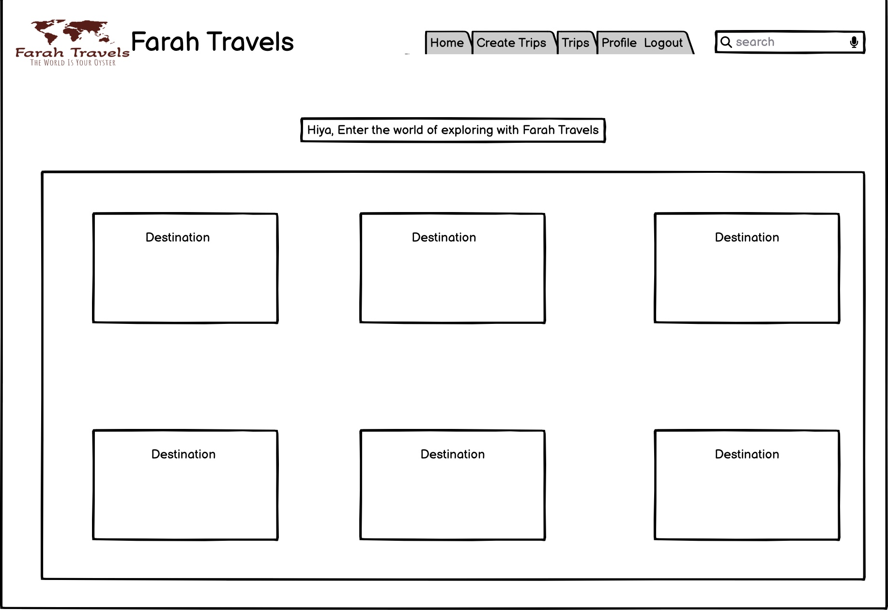
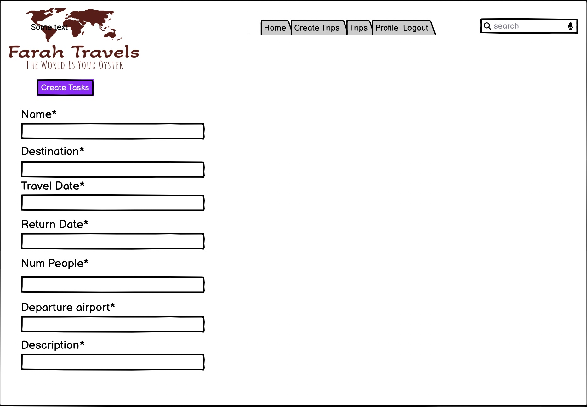
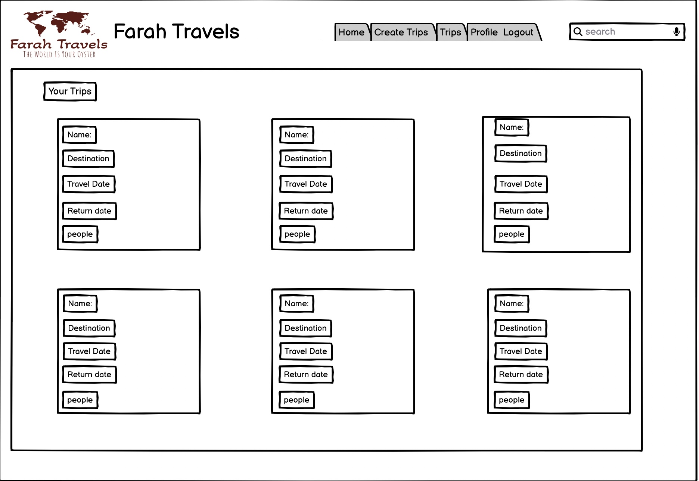

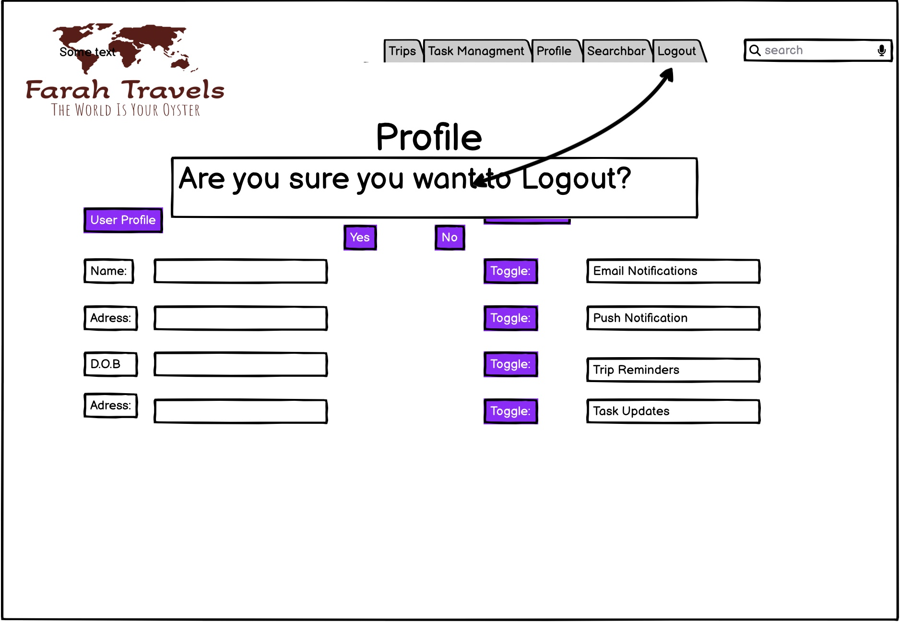

## Agile:

My project, Farah Travels, was created using an Agile priciple, which was managed througha project board on Github. This was a vital step towards ensuring that the design of my project was amazing. As this was my first time as an individual developer implementing agile the use of it had allowed me to have a structured framework which facilitated the development process and productivity of my app.

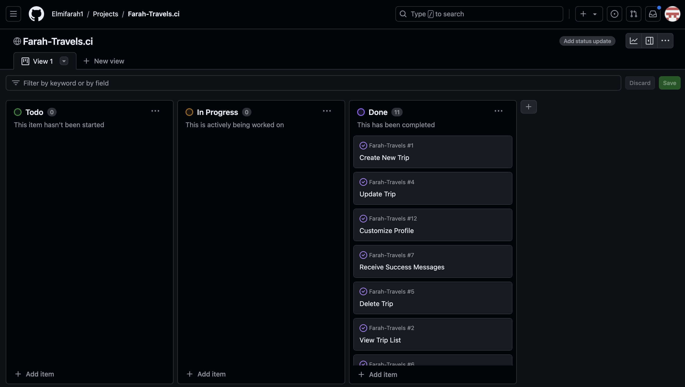

### Benefits of using Agile in my project was:

- The user stories provided specific goals to target, which helped in maintaining focus and reducing distractions.
- By focusing on user stories, the development process remained user-centric, ensuring that the application met the end-users' needs and provided a seamless user experience.
- Agile's flexibility allowed for adjustments and changes to be made as new insights and requirements emerged during the development process.

## Design Choices: 

### Colour Scheme

- Login/signup/forgot password: 
    - Background colour - #f0f0f0
    - Login container - rgba(173, 216, 230, 0.5); 
    - Button - #007bff

- Base pages:
    - Background colour - #f0f0f0
    - Home Page Cards - rgba(173, 216, 230, 0.5); 
    - Home Page Card Text - #333
    - Home Page Button - #007bff

I chose the colours of my travel app because it beautifully integrates the vibrant colours which enhances my user experience. This in fact makes the planning of a trip visually engaging and enjoyable. I have thought carefully about the implementations of my colours throughout so that the users can have a great journey whilst creating a their trip.

## Typography

I chose the following fonts so that my app would look professional and clean throughout, i did not want to go too over board and made sure my priortiy was user engagment and swiftness. Therefore i chose these fonts so that it would be easy to navigate through content on my app.

- 'Arial', sans-serif;

## Priority Features 

### Sign up
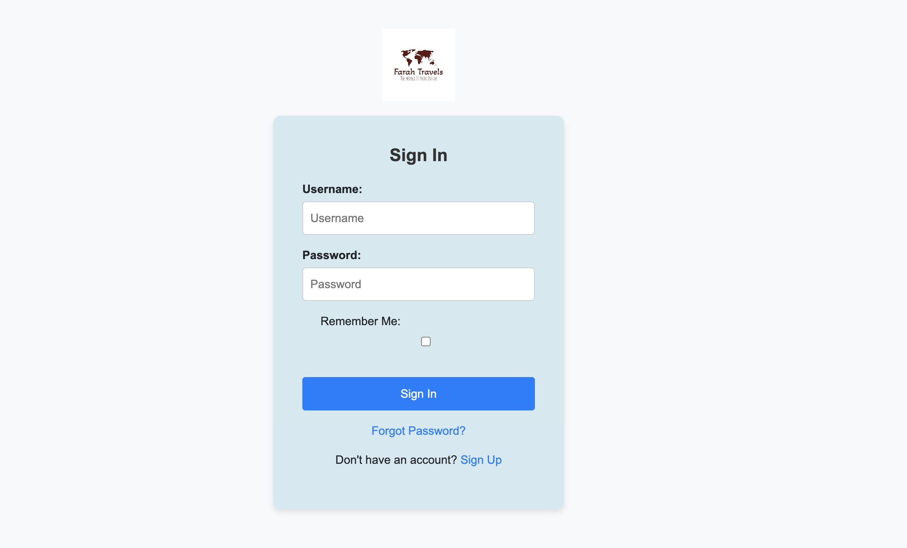

Users must have an account to be able to access the app.

### Login

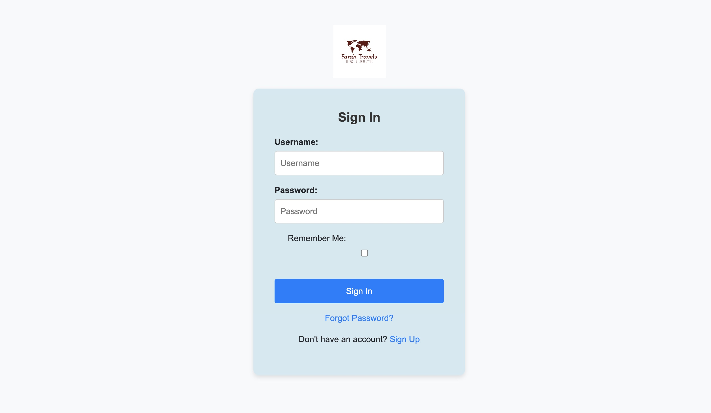

Users must sign in to use the app

### Home Page
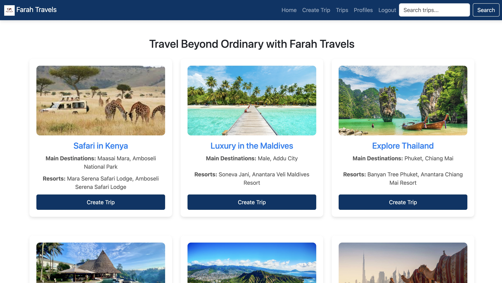

The landing page of Farah Travels introduces users to the platform with a sign option which encourgaes new users to sign up. By signing up and signing in, users can view the available trips, create new trips, and manage their profiles. The navigation bar provides quick and easy access to essential sections of the website, including Home, Trips, Create Trip, Profiles, searchbar and also a option too Logout.

### Create trip

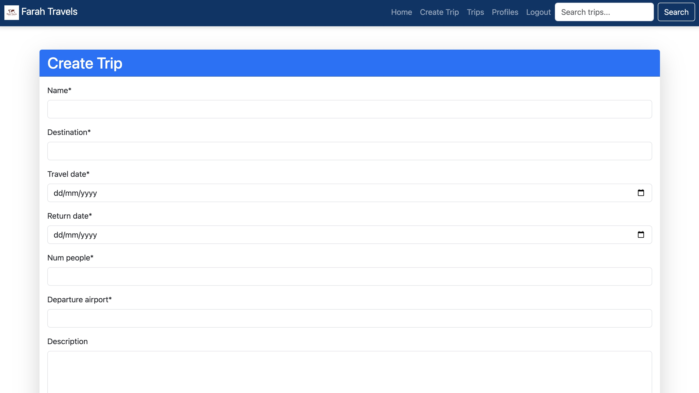

This section of my app allows the users to create a trip based on where they would like to go, it allows them to chose the dates and also the locations of where they want to go. Also gives the users options to edit or delete whenever they would like to do.

### View Trip
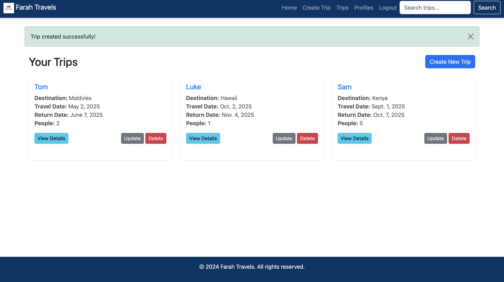

This section allows users to view the page where their trips are located in, they can also update and delete the trips from this section of the app.

### Create profile 
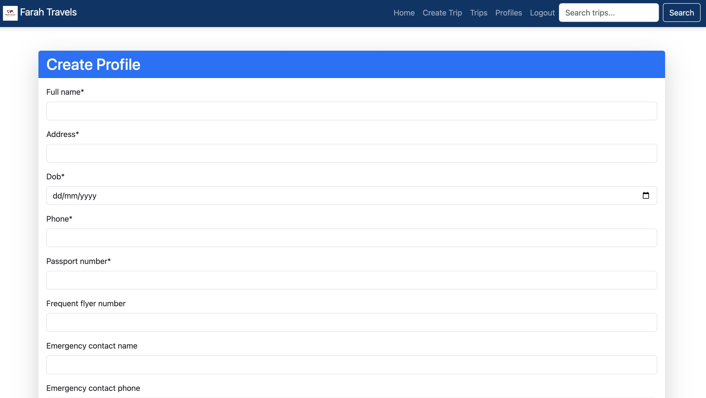

This section of my app allows users to create a profile which includes all their personal information such as adrress, passport number and date of birth.

### View Profile 

This section allows the user to view their profile and to also update or delete it in the future, it also holds their important information.

### Future Features 

- I would like to implement a option where users will be able to view more details about the specific trips within my home page, in order to do this i would have to create seperate HTML templates and include information about the location and any extra's i want such as the weather and tusted travel agency to use that are verified by Farah Travels.
- Provide API'S to show Live deals that they can implement.
- Have a contact support feature where they can speak to a live agent.
- Include a new model for Taks, where the user can create tasks to help them get ready for the trip.
- Include clips and videos of given locations to grasp the users attention.
- Other features would be too also style and make the page look more appealing as my main requirement was too get the site working.

## DataBase Design:

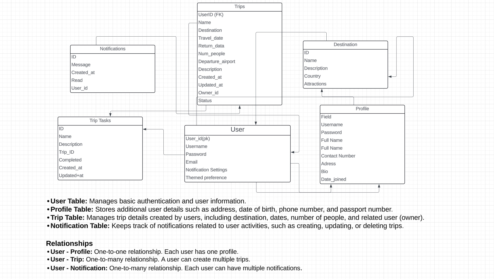

I used Lucid Chart to create an Entity Relationship Diagram (ERD), This was very helpful when i started planning out my Farah Travels app. The ERD made it easy to see how the databases connect and understand the relationships between tables. The arrows showed how the data fields are linked, ensuring a logical data structure and making the development process smoother.

## Data Models:

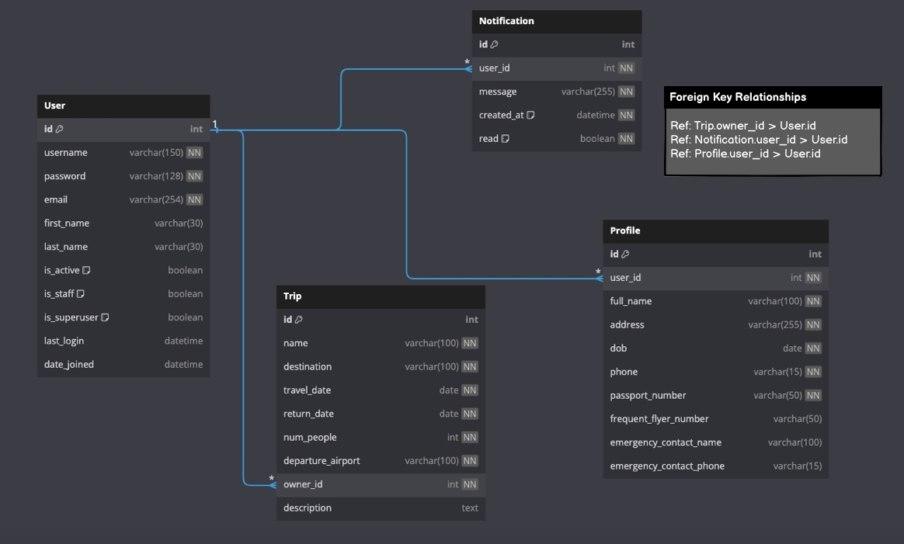

My database schema is designed to manage a travel application with user authentication and various features for managing trips, notifications, profiles. At the core of the schema is the User table, which utilizes Django's built-in User model for user management. This table includes fields for usernames, passwords, emails, and user status attributes such as whether the user is active, or a superuser. Django Allauth is integrated to handle user authentication, registration, and social login features, ensuring a secure and user-friendly authentication process.

- The User table stores essential user information, using Django's built-in model for authentication and user management. Each user can create, update, and delete trips, with these trips linked to the user via the Trip table. This table includes details like trip name, destination, dates, number of people, and departure airport.

- Notifications are handled through the Notification table, linked to the User table. Each notification is associated with a user and includes a message notifiying the user on the change or action preformed.

- The Profile table has a one-to-one relationship with the User table, storing additional personal information like full name, address, date of birth, phone number, passport number, and emergency contact details.

## Validation 

[W3C Validator](https://validator.w3.org/nu/) - to validate my HTML files.

### HTML

| Page | W3C URL | Screenshot | Notes |
| --- | --- | --- | --- |
| Home | [W3C](https://validator.w3.org/nu/?doc=https%3A%2F%2Ffarahtravels-e6089254b282.herokuapp.com%2F) | 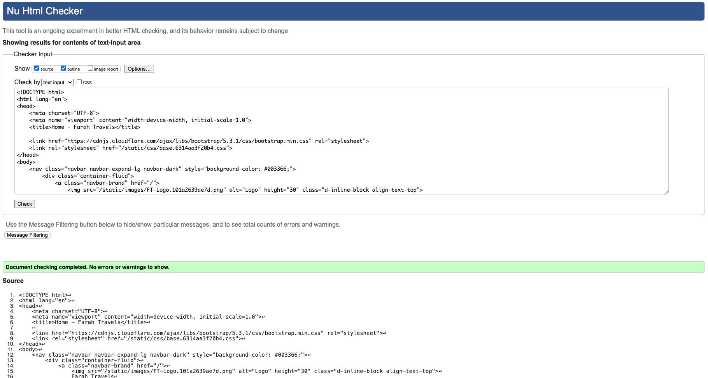 | Pass: No Errors |
| Create Trip | [W3C](https://validator.w3.org/nu/?doc=https%3A%2F%2Ffarahtravels-e6089254b282.herokuapp.com%2Ftrips%2Fnew%2F) | 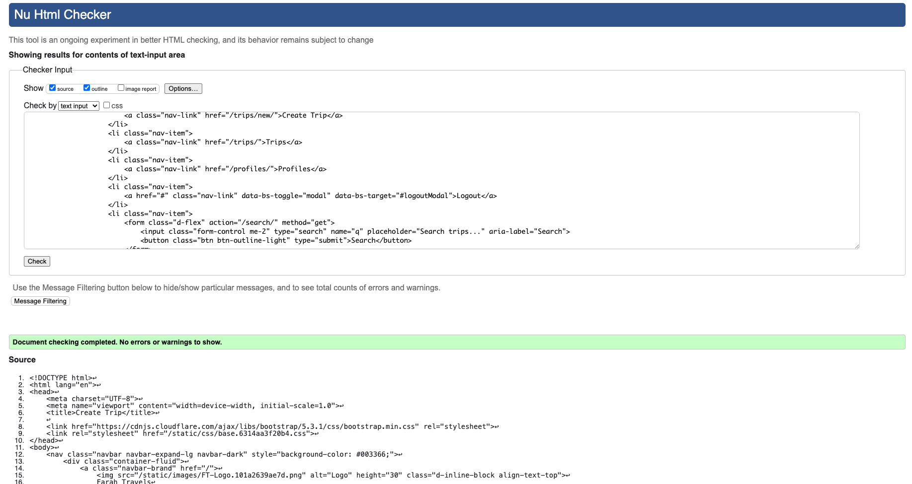 | Pass: No Errors |
| View Trips | [W3C](https://validator.w3.org/nu/?doc=https%3A%2F%2Ffarahtravels-e6089254b282.herokuapp.com%2Ftrips%2F) | 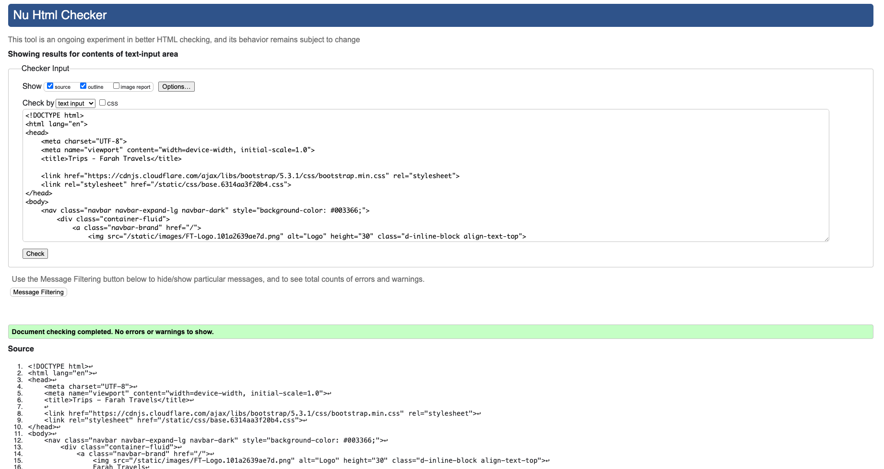 | Pass: No Errors |
| Profile | [W3C](https://validator.w3.org/nu/?showsource=yes&showoutline=yes&doc=https%3A%2F%2Ffarahtravels-e6089254b282.herokuapp.com%2Fprofiles%2F) | 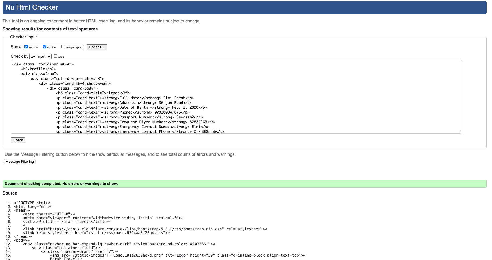 | Pass: No Errors |
| Sign Up| [W3C](https://validator.w3.org/nu/?doc=https%3A%2F%2Ffarahtravels-e6089254b282.herokuapp.com%2Faccounts%2Fsignup%2F) | 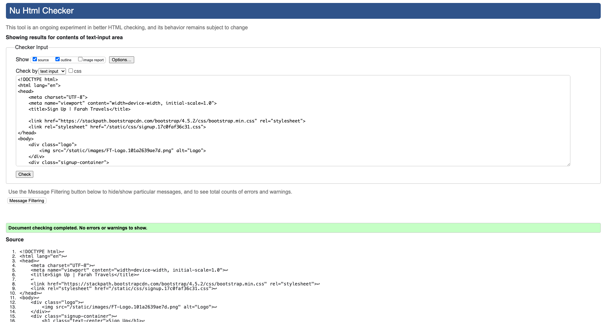 | Pass: No Errors |
| Sign in | [W3C](https://validator.w3.org/nu/?doc=https%3A%2F%2Ffarahtravels-e6089254b282.herokuapp.com%2Faccounts%2Flogin%2F%3Fnext%3D%2F) | 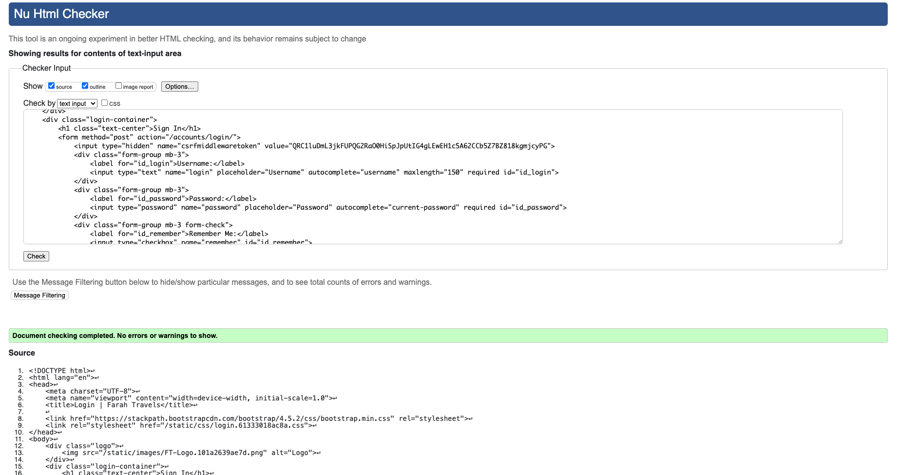 | Pass: No Errors |

### CSS

 - [CSS Jigsaw Validator](https://jigsaw.w3.org/css-validator) to validate my CSS files.
 
| File | Jigsaw URL | Screenshot | Notes |
| --- | --- | --- | --- |
| Base.css | [Jigsaw](https://jigsaw.w3.org/css-validator/validator?uri=https%3A%2F%2Ffarahtravels-e6089254b282.herokuapp.com%2Fstatic%2Fcss%2Fbase.css&profile=css3svg&usermedium=all&warning=1&vextwarning=&lang=en) | 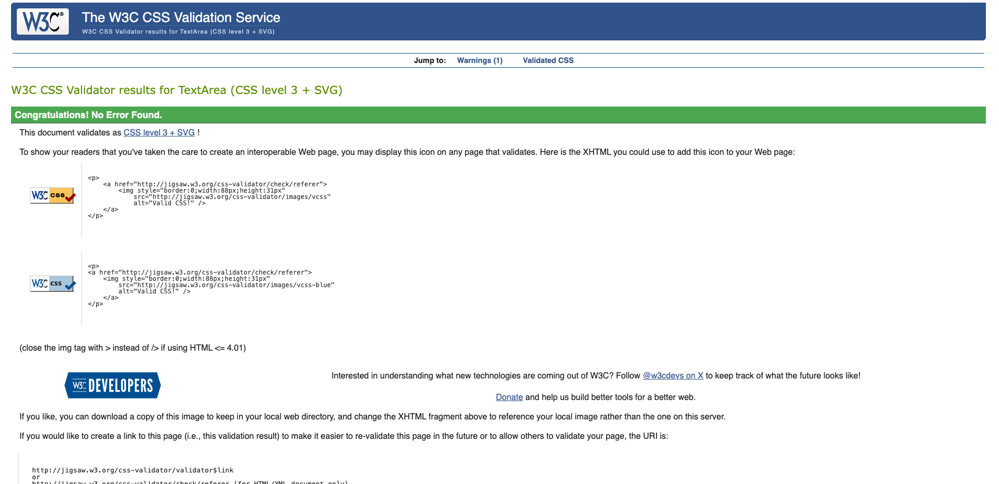  | Pass: No Errors |
| home.css | [Jigsaw](https://jigsaw.w3.org/css-validator/validator?uri=https%3A%2F%2Ffarahtravels-e6089254b282.herokuapp.com%2Fstatic%2Fcss%2Fhome.css&profile=css3svg&usermedium=all&warning=1&vextwarning=&lang=en) | 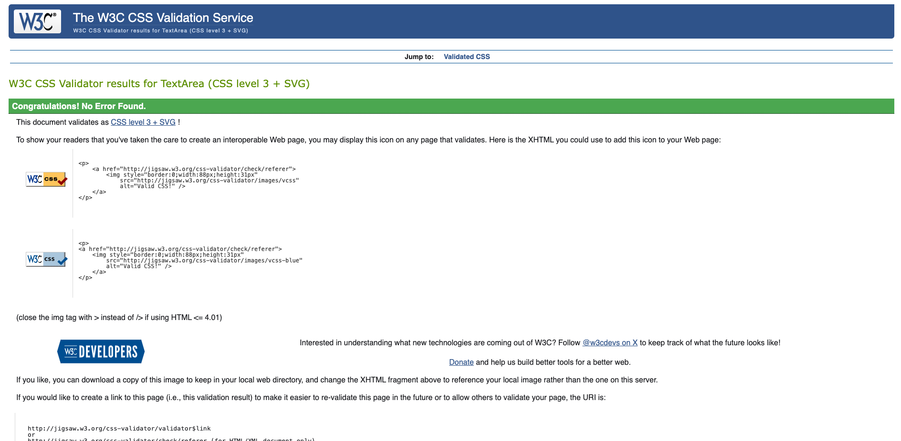  | Pass: No Errors |
| login.css | [Jigsaw](https://jigsaw.w3.org/css-validator/validator?uri=https%3A%2F%2Ffarahtravels-e6089254b282.herokuapp.com%2Fstatic%2Fcss%2Flogin.css&profile=css3svg&usermedium=all&warning=1&vextwarning=&lang=en) | 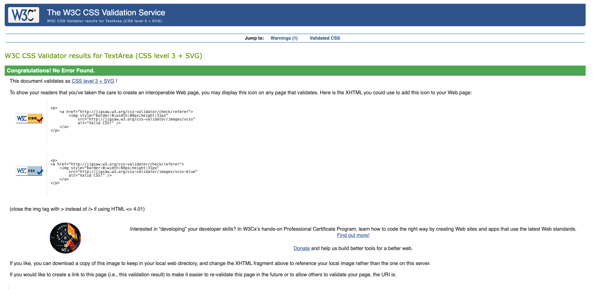  | Pass: No Errors |
| password_reset.css | [Jigsaw](https://jigsaw.w3.org/css-validator/validator?uri=https%3A%2F%2Ffarahtravels-e6089254b282.herokuapp.com%2Fstatic%2Fcss%2Fpassword_reset.css&profile=css3svg&usermedium=all&warning=1&vextwarning=&lang=en) |   | Pass: No Errors |
| signup.css | [Jigsaw](https://jigsaw.w3.org/css-validator/validator?uri=https%3A%2F%2Ffarahtravels-e6089254b282.herokuapp.com%2Fstatic%2Fcss%2Fsignup.css&profile=css3svg&usermedium=all&warning=1&vextwarning=&lang=en) | 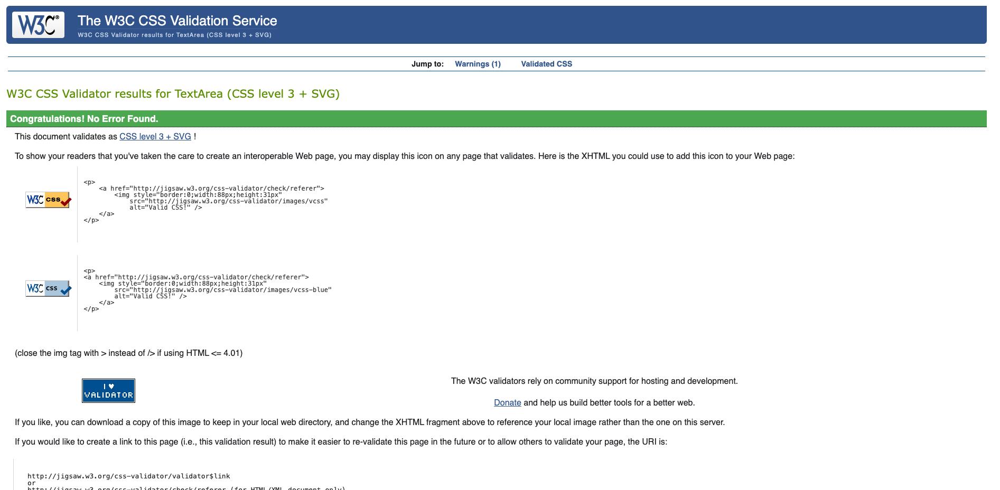  | Pass: No Errors |

### Python

I have used the recommended [PEP8 CI Python Linter](https://pep8ci.herokuapp.com) to validate all of my Python files.

| File | CI URL | Screenshot | Notes |
| --- | --- | --- | --- |
| forms.py | [PEP8 CI](https://pep8ci.herokuapp.com/https://raw.githubusercontent.com/hiboibrahim/thebookbooth1/main/run.py) |   | Pass: No Errors |
| settings.py | [PEP8 CI](https://pep8ci.herokuapp.com/https://raw.githubusercontent.com/hiboibrahim/thebookbooth1/main/boutique-ado/settings.py) | ![screenshot]
 | Pass: No Errors |
| Book views.py | [PEP8 CI](https://pep8ci.herokuapp.com/https://raw.githubusercontent.com/hiboibrahim/thebookbooth1/main/blog/views.py) | ![screenshot]
 | Pass: No Errors |
| Book urls.py | [PEP8 CI](https://pep8ci.herokuapp.com/https://raw.githubusercontent.com/hiboibrahim/thebookbooth1/main/checkout/urls.py) | ![screenshot]
 | Pass: No Errors |
|  models.py | [PEP8 CI](https://pep8ci.herokuapp.com/https://raw.githubusercontent.com/hiboibrahim/thebookbooth1/main/profiles/models.py) | ![screenshot]
 | Pass: No Errors |