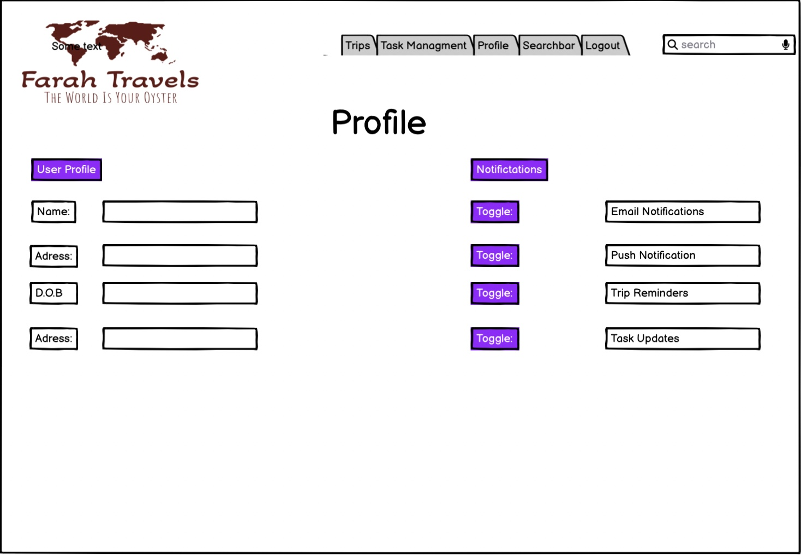
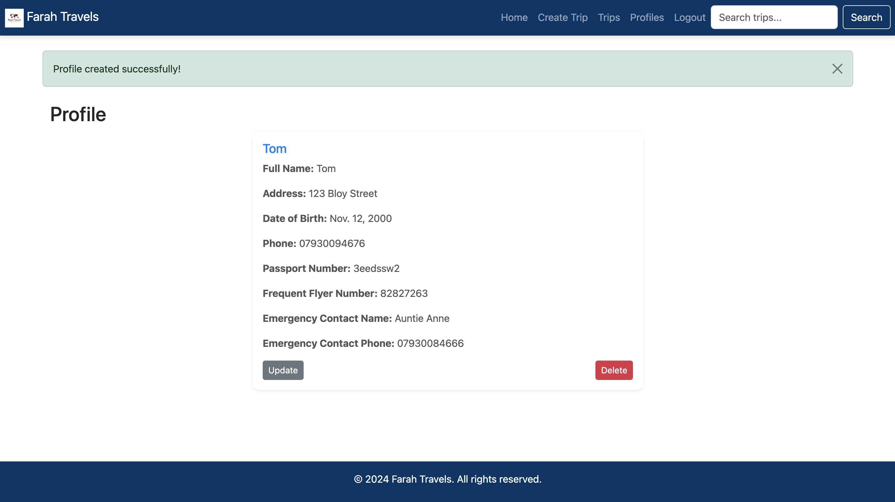

# Farah Travels 

 

### View live site here : [Farah Travels](https://farahtravels-e6089254b282.herokuapp.com/)  

### For Admin access with relevant sign-in information: [Farah Travels Admin](https://farahtravels-e6089254b282.herokuapp.com/admin/login/?next=/admin/)

## Table of Contents

- [FarahTravels](#farahtravels)
  - [Overview](#overview)

- [Purpose and Target Audience](#purpose-and-target-audience)
  - [Problem Statement](#problem-statement)
  - [Purpose](#purpose)
  - [Target Audience](#target-audience)

- [Persona](#persona)

- [User Stories](#user-stories)

- [Wireframes](#wireframes)

- [Agile](#agile)
  - [Benefits of using Agile in my project was](#benefits-of-using-Agile-in-my-project-was)

- [Design Choices](#design-choices)
  - [Colour Scheme](#colour-scheme)
  - [Typography](#typography)

- [Priority Features](#priority-features)
  - [Sign up](#sign-up)
  - [Login](#Login)
  - [Home](#home)
  - [Create Trip](#create-trip)
  - [View Trip](#view-trip)
  - [Create Profile](#create-profile)
  - [View Profile](#view-profile)
  - [Future Features](#future-features)

- [Database Schema](#database-schema)

- [Admin Panel](#admin-panel)

- [Validation](#Validation)
  - [HTML](#html)
  - [CSS](#html)
  - [Python](#python)

- [Page Links](#page-links)

- [Notification](#notification)

- [Responsivness](#responsivness)

- [Technologies Used](#technologies-used)
  - [Libraries \& Frameworks](#libraries--frameworks)
  - [Tools \& Programs](#tools--programs)

- [Testing](#testing)
  - [Manual Testing](#manual-testing)


- [Deployment](#deployment)
  - [Connecting to GitHub](#connecting-to-github)
  - [Django Project Setup](#django-project-setup)
  - [Cloudinary API](#cloudinary-api)
  - [PostgreSQL](#postgresql)
  - [Heroku deployment](#heroku-deployment)
  - [Clone project](#clone-project)
  - [Fork Project](#fork-project)


## Overview

#### Farah Travels is a comprehensive travel management app that allows users to seamlessly organise and manage their travel plans. With this app, you can:

- Create and Manage Trips: Easily plan your trips by adding destinations, travel dates, the number of people traveling, departure airport, and other details.
- Receive Notifications: Get timely updates and notifications about your travel plans, helping you stay informed.
- Profile Management: Maintain a detailed user profile, including full name, address, date of birth, phone number, passport number, frequent flyer number, and emergency contact information.
- Search Trips: Effortlessly search for trips based on destination or trip name, making it easy to find and review your travel plans.
- Password Management: Securely reset your password if you forget it, ensuring you always have access to your account.
- User-Friendly Interface: Experience a consistent and professional design across all pages, making navigation and use of the app intuitive and enjoyable.

## Purpose and Target Audience:

### Problem Statement:
Travelers often face challenges in organising their trips, keeping track of important information, and accessing their travel plans on-the-go. Additionally, managing travel-related personal information securely and effectively is essential. Users also need a way to search for and review their travel plans and ensure their profiles are current and accurate.

### Purpose:
Farah Travels is designed to provide a seamless travel management experience. The app will allow users to:

Create and manage trips with detailed information such as destinations, travel dates, number of travelers, and departure airport.
Maintain a comprehensive user profile, including personal and travel-related information such as full name, address, date of birth, phone number, passport number, and emergency contacts.
Search for and review travel plans based on specific criteria.
Securely reset passwords to ensure constant access to their accounts.

### Target Audience:
The primary target audience includes frequent travelers who need a reliable tool to organise their trips. It also targets individuals who value having an up-to-date and secure profile for travel purposes, as well as those who appreciate a user-friendly interface to streamline their travel planning and management processes.


## Persona:

Roxie is a frequent traveller who loves exploring new destinations. She enjoys meticulously planning her trips and values having all her travel information organised in one place. Roxie wants an efficient way to manage her travel plans, keep her personal information up-to-date, and ensure that her trips go smoothly.

## User Stories:

- As a user, I want to be able to create an account so that I can manage my travel plans and profile information.
- As a traveler, I want to be able to create a new trip with detailed information so that I can keep my travel plans organised.
- As a user, I want to view a list of my upcoming trips so that I can easily access and review my travel plans.
- As a traveler, I want to edit the details of my trips so that I can update my plans if anything changes.
- As a user, I want to delete a trip that I no longer plan to take so that my travel list remains current and relevant.
- As a user, I want to create and update my profile with personal and travel-related information so that I can have all my details in one place.
- As a traveler, I want to view my profile information in a structured format so that I can quickly review and ensure my details are accurate.
- As a traveler, I want to search for specific trips based on destination or trip name so that I can quickly find the information I need.
- As a user, I want to receive confirmation messages when I create, update, or delete trips and profiles so that I know my actions were successful.
- As a user, I want to confirm before logging out so that I do not accidentally end my session.
- As a traveller, I want to explore new travel destinations and see detailed information about each location so that I can plan future trips.

## Wireframes:





## Agile:

My project, Farah Travels, was created using an Agile priciple, which was managed througha project board on Github. This was a vital step towards ensuring that the design of my project was amazing. As this was my first time as an individual developer implementing agile the use of it had allowed me to have a structured framework which facilitated the development process and productivity of my app.


### Benefits of using Agile in my project was:

- The user stories provided specific goals to target, which helped in maintaining focus and reducing distractions.
- By focusing on user stories, the development process remained user-centric, ensuring that the application met the end-users' needs and provided a seamless user experience.
- Agile's flexibility allowed for adjustments and changes to be made as new insights and requirements emerged during the development process.


## Design Choices: 

### Colour Scheme

- Login/signup/forgot password: 
    - Background colour - #f0f0f0
    - Login container - rgba(173, 216, 230, 0.5); 
    - Button - #007bff

- Base pages:
    - Background colour - #f0f0f0
    - Home Page Cards - rgba(173, 216, 230, 0.5); 
    - Home Page Card Text - #333
    - Home Page Button - #007bff

I chose the colours of my travel app because it beautifully integrates the vibrant colours which enhances my user experience. This in fact makes the planning of a trip visually engaging and enjoyable. I have thought carefully about the implementations of my colours throughout so that the users can have a great journey whilst creating a their trip.

## Typography

I chose the following fonts so that my app would look professional and clean throughout, i did not want to go too over board and made sure my priortiy was user engagment and swiftness. Therefore i chose these fonts so that it would be easy to navigate through content on my app.

- 'Arial', sans-serif;

## Priority Features 

### Sign up


Users must have an account to be able to access the app.


### Login


Users must sign in to use the app


### Home Page


The landing page of Farah Travels introduces users to the platform with a sign option which encourgaes new users to sign up. By signing up and signing in, users can view the available trips, create new trips, and manage their profiles. The navigation bar provides quick and easy access to essential sections of the website, including Home, Trips, Create Trip, Profiles, searchbar and also a option too Logout.


### Create trip


This section of my app allows the users to create a trip based on where they would like to go, it allows them to chose the dates and also the locations of where they want to go. Also gives the users options to edit or delete whenever they would like to do.

### View Trip


This section allows users to view the page where their trips are located in, they can also update and delete the trips from this section of the app.


### Create profile 


This section of my app allows users to create a profile which includes all their personal information such as adrress, passport number and date of birth.


### View Profile 



This section allows the user to view their profile and to also update or delete it in the future, it also holds their important information.

### Future Features 

- I would like to implement a option where users will be able to view more details about the specific trips within my home page, in order to do this i would have to create seperate HTML templates and include information about the location and any extra's i want such as the weather and tusted travel agency to use that are verified by Farah Travels.
- Provide API'S to show Live deals that they can implement.
- Have a contact support feature where they can speak to a live agent.
- Include a new model for Taks, where the user can create tasks to help them get ready for the trip.
- Include clips and videos of given locations to grasp the users attention.
- Other features would be too also style and make the page look more appealing as my main requirement was too get the site working.

## Database Schema:


My database schema is designed to manage a travel application with user authentication and various features for managing trips, notifications, profiles. At the core of the schema is the User table, which utilises Django's built-in User model for user management. This table includes fields for usernames, passwords, emails or a superuser. Django Allauth is integrated to handle user authentication, registration, and social login features, ensuring a secure and user-friendly authentication process.


- The User table stores essential user information, using Django's built-in model for authentication and user management. Each user can create, update, and delete trips, with these trips linked to the user via the Trip table. This table includes details like trip name, destination, dates, number of people, and departure airport.

- Notifications are handled through the Notification table, linked to the User table. Each notification is associated with a user and includes a message notifiying the user on the change or action preformed.

- The Profile table has a one-to-one relationship with the User table, storing additional personal information like full name, address, date of birth, phone number, passport number, and emergency contact details.


## Admin Panel

Through Django's built-in Administration Panel, administrators have full control over the data submitted to the website by registered users. To access the Admin panel, the administrator appends '/admin/' to the website's URL, resulting in https://8000-elmifarah1-farahtravels-l9xrnkqc3j5.ws.codeinstitute-ide.net/admin.com/admin/. A username and password are required to log in.

For Farah Travels, administrator approval is required to book or view trips and to also ensure the site remains on topic and free from spam. Registered, logged-in users have instant access to create trips and view trips.


## Validation 

[W3C Validator](https://validator.w3.org/nu/) - to validate my HTML files.

### HTML

| Page | W3C URL | Screenshot | Notes |
| --- | --- | --- | --- |
| Home | [W3C](https://validator.w3.org/nu/?doc=https%3A%2F%2Ffarahtravels-e6089254b282.herokuapp.com%2F) |  | Pass: No Errors |
| Create Trip | [W3C](https://validator.w3.org/nu/?doc=https%3A%2F%2Ffarahtravels-e6089254b282.herokuapp.com%2Ftrips%2Fnew%2F) |  | Pass: No Errors |
| View Trips | [W3C](https://validator.w3.org/nu/?doc=https%3A%2F%2Ffarahtravels-e6089254b282.herokuapp.com%2Ftrips%2F) |  | Pass: No Errors |
| Profile | [W3C](https://validator.w3.org/nu/?showsource=yes&showoutline=yes&doc=https%3A%2F%2Ffarahtravels-e6089254b282.herokuapp.com%2Fprofiles%2F) |  | Pass: No Errors |
| Sign Up| [W3C](https://validator.w3.org/nu/?doc=https%3A%2F%2Ffarahtravels-e6089254b282.herokuapp.com%2Faccounts%2Fsignup%2F) |  | Pass: No Errors |
| Sign In | [W3C](https://validator.w3.org/nu/?doc=https%3A%2F%2Ffarahtravels-e6089254b282.herokuapp.com%2Faccounts%2Flogin%2F%3Fnext%3D%2F) |  | Pass: No Errors |


### CSS


 - [CSS Jigsaw Validator](https://jigsaw.w3.org/css-validator) to validate my CSS files.
 
| File | Jigsaw URL | Screenshot | Notes |
| --- | --- | --- | --- |
| Base.css | [Jigsaw](https://jigsaw.w3.org/css-validator/validator?uri=https%3A%2F%2Ffarahtravels-e6089254b282.herokuapp.com%2Fstatic%2Fcss%2Fbase.css&profile=css3svg&usermedium=all&warning=1&vextwarning=&lang=en) |   | Pass: No Errors |
| home.css | [Jigsaw](https://jigsaw.w3.org/css-validator/validator?uri=https%3A%2F%2Ffarahtravels-e6089254b282.herokuapp.com%2Fstatic%2Fcss%2Fhome.css&profile=css3svg&usermedium=all&warning=1&vextwarning=&lang=en) |   | Pass: No Errors |
| login.css | [Jigsaw](https://jigsaw.w3.org/css-validator/validator?uri=https%3A%2F%2Ffarahtravels-e6089254b282.herokuapp.com%2Fstatic%2Fcss%2Flogin.css&profile=css3svg&usermedium=all&warning=1&vextwarning=&lang=en) |   | Pass: No Errors |
| password_reset.css | [Jigsaw](https://jigsaw.w3.org/css-validator/validator?uri=https%3A%2F%2Ffarahtravels-e6089254b282.herokuapp.com%2Fstatic%2Fcss%2Fpassword_reset.css&profile=css3svg&usermedium=all&warning=1&vextwarning=&lang=en) |   | Pass: No Errors |
| signup.css | [Jigsaw](https://jigsaw.w3.org/css-validator/validator?uri=https%3A%2F%2Ffarahtravels-e6089254b282.herokuapp.com%2Fstatic%2Fcss%2Fsignup.css&profile=css3svg&usermedium=all&warning=1&vextwarning=&lang=en) |   | Pass: No Errors |


### Python

- Used [PEP8 CI Python Linter](https://pep8ci.herokuapp.com) to validate all of my Python files.

| File | CI URL | Screenshot | Notes |
| --- | --- | --- | --- |
| forms.py | [PEP8 CI](https://pep8ci.herokuapp.com/) |   | Pass: No Errors |
| settings.py | [PEP8 CI](https://pep8ci.herokuapp.com/) |   | Pass: No Errors |
| urls.py | [PEP8 CI](https://pep8ci.herokuapp.com/) |   | Pass: No Errors |
| views.py | [PEP8 CI](https://pep8ci.herokuapp.com/) |   | Pass: Although i have two errors stating that line 92 and 135 are too long, i still believe it is readable and ully functioning so it should not be that much of an issue. |
| models.py | [PEP8 CI](https://pep8ci.herokuapp.com/) |   | Pass: No Errors |

## Page Links 

## Links

| Link | Expected Outcome | Grade |
| ------- | ---------------- | ----- |
| Logo | Navigates to the home page when clicked | Pass |
| Home | Navigates to the home page when clicked | Pass |
| Trips | Navigates to a trips list  page when clicked | Pass |
| Create Trips | Navigates to a form to create a trip when clicked | Pass |
| Profile | Navigates to a Profile Page form when clicked | Pass |
| Sign up | Navigates to a registration form when clicked | Pass |
| Log in | Navigates to a screen where users can log in when clicked | Pass |
| Logout | Navigates to a page confirming for the user to log out | Pass |


## Notification

I have implemented notifcations to show that the users are able to confirm when they have done an action such as signing in or deleting/creating a trip or profile.


## Responsivness 

I used the inspect/development tools in order to test wether or not my app is responsive across different devices and platforms such as laptops, mobile phones and also tablets.

i conducted full tests on the following devices 

| Device | CI URL | Screenshot | Notes |
| --- | --- | --- | --- |
| ipad pro | [Farah Travels](https://farahtravels-e6089254b282.herokuapp.com/) |   | My App is fully responsive on the I pad pro device |
| Ipad Air | [Farah Travels](https://pep8ci.herokuapp.com/) |   | App is fully responsive with no issue on the Ipad Air |
| Iphone XR | [Farah Travels](https://pep8ci.herokuapp.com/) |   | App is fully responsive with no issue on the I phone XR |
| Iphone SE | [Farah Travels](https://pep8ci.herokuapp.com/) |   | App is fully responsive with no issue on the I phone SE |

### Browser

I then went onto testing the following browsers:

- **Google Chrome**
 
- **Firefox**
  
- **Safari**
  

- All the browsers are responsives and works great without any errors or bugs

 ## Technologies used 

**Technologies & Languages Used**

 - Django
 - HTML
 - CSS
 - SQL 
 - Git
 - Gitpod 
 - github 
 - Cloudinary 
 - Heroku
 - Balsamiq

### Libraries & Frameworks
 - asgiref==3.8.1
 - cloudinary==1.40.0
 - crispy-bootstrap5==2024.2
 - dj-database-url==0.5.0
 - dj3-cloudinary-storage==0.0.6
 - Django==4.2.13
 - django-allauth==0.63.3
 - django-bootstrap5==24.2
 - django-crispy-forms==2.2
 - gunicorn==20.1.0
 - psycopg2==2.9.9
 - sqlparse==0.5.0
 - whitenoise==6.7.0

### Tools & Programs
 - favicon
 - trello
 - git project
 - chatgpt
 - Dbdiagram
 - slack
 - stackoverflow
 - coding coach

## Testing

### Lighthouse Audit:
 
 Desktop Sign In:

  

Mobile Sign In:

  

Desktop Home Page:

  

 Mobile Home Page:

   


## Deployment

### Connecting to Github 

In order to start this project from scratch, you must first create a new Github repository using [Code Institute's Template](https://github.com/Code-Institute-Org/ci-full-template). This template provides the relevant tools that will get you started. to use this template you must:

1. Log in to [GitHub](https://github.com/) or create a new account.
2. Navigate to the above CI Full Template.
3. Click '**Use this template**' -> '**Create a new repository**'.
4. Choose a new repository name and click '**Create repository from template**'.
5. In your new repository space, click the purple CodeAnywhere (if this is your IDE of choice) button to generate a new workspace.

### Django Project Setup

1. Install Django and supporting libraries: 
   
- ```pip3 install 'django<4' gunicorn```
- ```pip3 install dj_database_url psycopg2```
- ```pip3 install dj3-cloudinary-storage```  
  
2. Once you have installed any relevant dependencies or libraries, such as the ones listed above, it is important to create a **requirements.txt** file and add all installed libraries to it with the ```pip3 freeze --local > requirements.txt``` command in the terminal.  
3. Create a new Django project in the terminal ```django-admin startproject freefido .```
4. Create a new app eg. ```python3 mangage.py startapp booking```
5. Add this to list of **INSTALLED_APPS** in **settings.py** - 'booking',
6. Create a superuser for the project to allow Admin access and enter credentials: ```python3 manage.py createsuperuser```
7. Migrate the changes with commands: ```python3 manage.py migrate```
8. An **env.py** file must be created to store all protected data such as the **DATABASE_URL** and **SECRET_KEY**. These may be called upon in your project's **settings.py** file along with your Database configurations. The **env.py** file must be added to your **gitignore** file so that your important, protected information is not pushed to public viewing on GitHub. For adding to **env.py**:

- ```import os```
- ```os.environ["DATABASE_URL"]="<copiedURLfromElephantSQL>"```
- ```os.environ["SECRET_KEY"]="my_super^secret@key"```
  
For adding to **settings.py**:

- ```import os```
- ```import dj_database_url```
- ```if os.path.exists("env.py"):```
- ```import env```
- ```SECRET_KEY = os.environ.get('SECRET_KEY')``` (actual key hidden within env.py)  

9. Replace **DATABASES** with:

```
DATABASES = {
    'default': dj_database_url.parse(os.environ.get("DATABASE_URL"))
  }
```

10. Set up the templates directory in **settings.py**:
- Under ``BASE_DIR`` enter ``TEMPLATES_DIR = os.path.join(BASE_DIR, ‘templates’)``
- Update ``TEMPLATES = 'DIRS': [TEMPLATES_DIR]`` with:

```
os.path.join(BASE_DIR, 'templates'),
os.path.join(BASE_DIR, 'templates', 'allauth')
```

- Create the media, static and templates directories in top level of project file in IDE workspace.

11. A **Procfile** must be created within the project repo for Heroku deployment with the following placed within it: ```web: gunicorn freefido.wsgi```
12. Make the necessary migrations again.

### Cloudinary API 

Cloudinary provides a cloud hosting solution for media storage. All users uploaded images in the FreeFid project are hosted here.

Set up a new account at [Cloudinary](https://cloudinary.com/) and add your Cloudinary API environment variable to your **env.py** and Heroku Config Vars.
In your project workspace: 

- Add Cloudinary libraries to INSTALLED_APPS in settings.py 
- In the order: 
```
   'cloudinary_storage',  
   'django.contrib.staticfiles',  
   'cloudinary',
```
- Add to **env.py** and link up with **settings.py**: ```os.environ["CLOUDINARY_URL"]="cloudinary://...."``` 
- Set Cloudinary as storage for media and static files in settings.py:
- ```STATIC_URL = '/static/'```
```
  STATICFILES_STORAGE = 'cloudinary_storage.storage.StaticHashedCloudinaryStorage'  
  STATICFILES_DIRS = [os.path.join(BASE_DIR, 'static'), ]  
  STATIC_ROOT = os.path.join(BASE_DIR, 'staticfiles')‌  
  MEDIA_URL = '/media/'  
  DEFAULT_FILE_STORAGE = 'cloudinary_storage.storage.MediaCloudinaryStorage'
```

## PostgreSQL

A new database instance can be created on [PostgreSQL](https://dbs.ci-dbs.net/) for your project. 

- Using your code institute email, Follow the steps in order to obtain a new Database
- From your email, retrieve the important 'postgres://....' value. Place the value within your **DATABASE_URL**  in your **env.py** file and follow the below instructions to place it in your Heroku Config Vars.

### Heroku Deployment 
To start the deployment process , please follow the below steps:

1. Log in to [Heroku](https://id.heroku.com/login) or create an account if you are a new user.
2. Once logged in, in the Heroku Dashboard, navigate to the '**New**' button in the top, right corner, and select '**Create New App**'.
3. Enter an app name and choose your region. Click '**Create App**'. 
4. In the Deploy tab, click on the '**Settings**', reach the '**Config Vars**' section and click on '**Reveal Config Vars**'. Here you will enter KEY:VALUE pairs for the app to run successfully. The KEY:VALUE pairs that you will need are your: 
   
   - **CLOUDINARY_URL**: **cloudinary://....** 
   - **DATABASE_URL**:**postgres://...** 
   - **DISABLE_COLLECTSTATIC** of value '1' (N.B Remove this Config Var before deployment),
   -  **PORT**:**8000**
   -  **SECRET_KEY** and value  
  
5. Add the Heroku host name into **ALLOWED_HOSTS** in your projects **settings.py file** -> ```['herokuappname', ‘localhost’, ‘8000 port url’].```
6. Once you are sure that you have set up the required files including your requirements.txt and Procfile, you have ensured that **DEBUG=False**, save your project, add the files, commit for initial deployment and push the data to GitHub.
7. Go to the '**Deploy**' tab and choose GitHub as the Deployment method.
8. Search for the repository name, select the branch that you would like to build from, and connect it via the '**Connect**' button.
9.  Choose from '**Automatic**' or '**Manual**' deployment options, I chose the 'Manual' deployment method. Click '**Deploy Branch**'.
10. Once the waiting period for the app to build has finished, click the '**View**' link to bring you to your newly deployed site. If you receive any errors, Heroku will display a reason in the app build log for you to investigate. **DISABLE_COLLECTSTATIC**  may be removed from the Config Vars once you have saved and pushed an image within your project, as can **PORT:8000**.

## Clone project

A local clone of this repository can be made on GitHub. Please follow the below steps:

1. Navigate to GitHub and log in.
2. The [Farah Travels Repository](https://github.com/Elmifarah1/Farah-Travels) can be found at this location.
3. Above the repository file section, locate the '**Code**' button.
4. Click on this button and choose your clone method from HTTPS, SSH or GitHub CLI, copy the URL to your clipboard by clicking the '**Copy**' button.
5. Open your Git Bash Terminal.
6. Change the current working directory to the location you want the cloned directory to be made.
7. Type `git clone` and paste in the copied URL from step 4.
8. Press '**Enter**' for the local clone to be created.
9. Using the ``pip3 install -r requirements.txt`` command, the dependencies and libraries needed for FreeFido will be installed.
10. Set up your **env.py** file and from the above steps for Cloudinary and ElephantSQL, gather the Cloudinary API key and the Elephant SQL url for additon to your code.
11. Ensure that your **env.py** file is placed in your **.gitignore** file and follow the remaining steps in the above Django Project Setup section before pushing your code to GitHub.

## Fork Project

A copy of the original repository can be made through GitHub. Please follow the below steps to fork this repository:  

1. Navigate to GitHub and log in.  
2. Once logged in, navigate to this repository using this link [Farah Travels Repository](https://github.com/Elmifarah1/Farah-Travels).
3. Above the repository file section and to the top, right of the page is the '**Fork**' button, click on this to make a fork of this repository.
4. You should now have access to a forked copy of this repository in your Github account.
5. Follow the above Django Project Steps if you wish to work on the project.